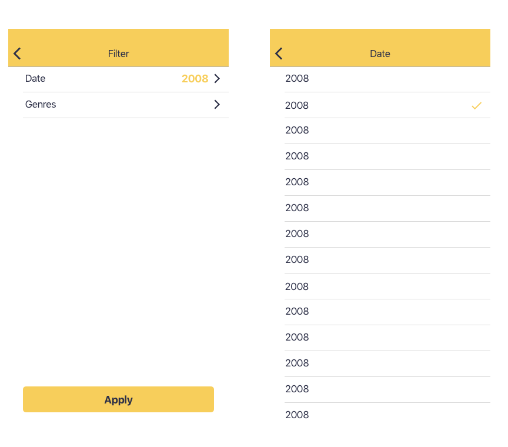

# Concrete iOS Challenge

---

## Bienvenido/a

---

¡Gracias por participar en el desafío iOS de Concrete! Estamos muy contentos por tu primer paso para formar parte de un equipo excepcional.

## Al final ¿qué es ese desafío?

Debes crear una aplicación sobre películas, usando la [API](https://developers.themoviedb.org/3/getting-started/introduction) de [TheMovieDB](https://www.themoviedb.org/?language=en).

Para tener un estándar y un layout minimamente definido adjuntamos algunos assets que te van a ayudar a desarrollar la aplicación:

- [Iconos de la aplicación](assets/appIcons)
- [Screenshots](assets/screenshots)
- [Iconos](assets/icons)

Piensa en el desafío como una oportunidad de mostrar todo tu conocimiento. **¡Hazlo con calma!** porque tienes una semana para entregar.

Dentro de los elementos que vamos a evaluar se encuentra:

- Consumo de APIs
- Persistencia de datos (Favoritos)
- Lógicas de filtros y búsquedas.
- Estructuración de layout y flujo de aplicación.

Los únicos requisitos previos para este desafío es que el código se haga en Swift (ojalá en su última versión) y utilizando UIKit (SwiftUI por ahora no es requerido). Eres libre de:

- Utilizar o no usar bibliotecas externas con el gestor de dependencias de tu preferencia (Cocoapods, Carthage, Swift Package Manager)
- Crear o estructurar tus vistas con Storyboards, Xibs o ViewCode.
- Adoptar la arquitectura que más te acomode y utilizar los patrones de diseño que desees.

Estamos especialmente preocupados por la calidad. Creemos que los patrones de diseño, pruebas automatizadas y la integración contínua son aspectos importantes. Sin embargo, sabemos que éstos no son tópicos dominados por todos y debido a eso hemos estructurado el desafío en varios niveles, los cuales van incrementando en dificultad. Esto implica que un postulante *Senior* debería ser capaz de completar más niveles.

# Proceso de desarrollo y envío

1. Haz un un fork de este repositorio. **No lo clones directamente ni intentes hacer push a este repositorio**.
2. Desarrolla tu proyecto en tu fork. Eres libre de crear/modificar/borrar las ramas que desees.
3. Al momento de hacer commit, sube los cambios a tu fork.
4. Por la interfaz de GitHub, haz un pull request a este repositorio.
5. En el pull request copia y pega la sección **Requerimientos** de este archivo y actualiza las cosas que hayas podido completar.
    - Si pudiste completar algún aspecto específico de alguna de las partes, por ejemplo, de la parte 5, pero no terminaste todo lo que se pedía, no hay problema en marcarlo.

Si tienes alguna consulta, no dudes en preguntarnos :)

# Requerimientos

## Información del postulante

### Nombre
Cristian Alexis Bahamondes Quiroga

### Comentarios

_(Cualquier consideración que quieras mencionar, déjala acá)_

## Parte 1
- [OK] Pantalla de Splash
- [OK] Pantalla con una grilla de películas populares. Para ello debes usar esta [API](https://developers.themoviedb.org/3/movies/get-popular-movies)
- [ ] Tratamiento de errores y presentación de flujos de excepción:
  - [ ] Error genérico
  - [ ] Cargando

## Parte 2
- [OK] Al hacer clic en una película de la grilla debe dirigirse a la pantalla de detalle de la película. Esta pantalla debe contener:
  - [OK] Nombre de la película
  - [OK] Año de estreno
  - [OK] Sinopsis
  - [OK] El nombre del género de la película y no su ID (ej: Action, Horror, etc). Para ello, debes utilizar esta [API](https://developers.themoviedb.org/3/genres/get-movie-list).

## Parte 3

- [OK] Selección de películas favoritas
  - [OK] La acción para poner como favorita una película debe estar en la pantalla creada en el nivel 2.
  - [OK] La información sobre las películas favoritas debe ser persistente, es decir, debe guardarse entre sesiones de la aplicación.
- [OK] Lista de películas favoritas:
  - [ ] Borrado de películas favoritas desde la lista.
- [OK] Layout en pestañas:
  - [OK] En la primera pestaña debes mostrarse la pantalla creada en el nivel 1.
  - [OK] En la segunda pestaña debes mostrar la lista de películas favoritas.

## Parte 4

- [ ] Mejoras a la grilla de películas populares:
  - [ ] Scroll infinito.
  - [ ] Mostrar si una película es favorita o no en cada celda de la grilla.
  - [ ] Búsqueda local (filtrar por algún término).
- [ ] Pantalla de filtro con selección de fecha de lanzamiento y género:
  - [ ] Sólo debe ser accesible desde la pantalla de favoritos.
  - [ ] Al aplicar el filtro, debes volver a la pantalla de favoritos y hacer un filtro local usando la información seleccionada referente a la fecha de lanzamiento y el género.
- [ ] Soporte para rotación y iPad.

## Parte 5

- [ ] Pruebas unitarias en el proyecto.
- [ ] Pruebas de snapshot.
- [ ] Pruebas de UI.
- [ ] Uso de SwiftLint.
- [ ] Uso de fastlane para generar binarios.
- [ ] Integración del repositorio con un servicio de integración continua como [Bitrise](https://www.bitrise.io/) o [AppCenter](https://appcenter.ms). No existe problema en usar otra plataforma, pero esta debe estar disponible online (un jenkins local no cuenta).
- [ ] Integración de un servicio de análisis de código como [SonarCloud](https://sonarcloud.io/).

# Ejemplos y sugerencias

A continuación puedes ver algunas pantallas de ejemplo de algunos flujos. Son sólo sugerencias, pero puedes modificarlas a tu gusto.
Para facilitar el proceso, tienes assets, iconos de aplicación y paleta de colores en el repositorio. Pero si su lado diseñador habla más alto ¡puedes sorprendernos!

## Flujo de grilla de películas

## Flujo con Splash, Pantalla de Detalles y pantalla de lista de favoritos

## Flujo opcional de filtro

