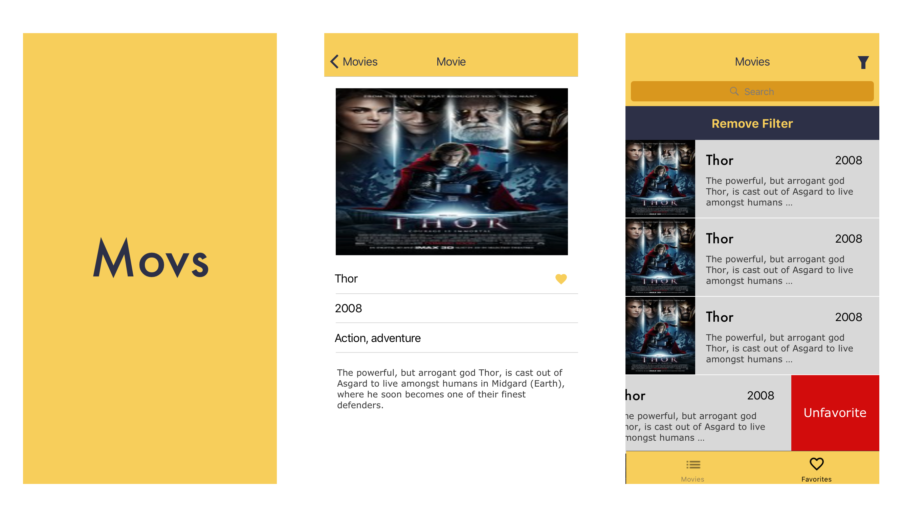

# Concrete iOS Recruit Challenge

---

## Bienvenido

---

Gracias por participar en el desafío iOS de Concrete! Estamos muy contentos por su primer paso para formar parte de un equipo excepcional.

## Al final, ¿qué es ese desafío?

---

Usted debe crear una aplicación sobre las películas, usando la [API](https://developers.themoviedb.org/3/getting-started/introduction) del [TheMovieDB](https://www.themoviedb.org/?language=en). Guay, ¿verdad? Para dar una estandarizada y tener un layout mínimamente definido adjuntamos algunos activos que te van a ayudar a desarrollar esa aplicación:

- [Iconos de la aplicación](assets/appIcons)
- [ScreenShots](assets/screenshots)
- [Iconos](assets/icons)

Piense en el desafío como una oportunidad de mostrar todo su conocimiento. ¡Y haga con calma, usted tiene una semana para entregar!
Vamos a evaluar cómo se manejan casos de:

- Consumo de APIs
- Persistencia de datos (Favoritos)
- Lógicas de filtros y búsquedas.
- Estructuración de layout y flujo de aplicación.

El único requisito previo es que el código se haga en Swift, preferentemente en la versión más actual. Se siente la voluntad para:

- Utilizar o no usar bibliotecas
- Estructurar su layout con storyboards, xibs o ViewCode
- Adoptar la arquitectura que desee.

Estamos especialmente preocupados por la calidad y creemos bastante en pruebas automatizadas. Sin embargo, sabemos que no es un tópico dominado por todos, por eso aceptamos desafíos con todos los perfiles y diferentes momentos de experiencia y conocimiento técnico.
Para las posiciones más Seniors, sin embargo, damos mucha importancia a la calidad del código.

# Features ..

---

### Necesita tener:

- Pantalla de Splash;
- En la primera pestaña la pantalla de cuadrícula de películas y en la segunda pestaña la pantalla de lista de películas favorables en la aplicación;
- Pantalla de grid de películas trayendo la lista de películas populares de la película. [API](https://developers.themoviedb.org/3/movies/get-popular-movies).
- Tratamiento de errores y presentación de los flujos de excepción: Búsqueda vacía, Error generico, loading;
- Al hacer clic en una película de la cuadrícula debe navegar a la pantalla de detalle de la película;
- La pantalla de Detalle de la película debe contener acción para favorecer la película;
- La pantalla de Detalle de la película debe contener el género de la película por extenso (ex: Action, Horror, etc); Utilice este [request](https://developers.themoviedb.org/3/genres/get-movie-list) del API para traer la lista.
- Pantalla de lista de favoritos persistente en la aplicación entre sesiones;
- La pantalla de favoritos debe permitir desfavoritar una película.

### Gana más puntos si tienes:

- Pantalla de grid con búsqueda local;
- Scroll Infinito para hacer paginación de la API de películas populares;
- Célula del Grid de películas con información si la película fue favorecida en la aplicación o no;
- Pantalla de filtro con selección de fecha de lanzamiento y género. La pantalla de filtro sólo es accesible desde la pantalla de favoritos;
- Al aplicar el filtro, volver a la pantalla de favoritos y hacer un filtro local usando la información seleccionada referente a la fecha de lanzamiento y el género;
- Pruebas unitarias en el proyecto;
- Pruebas funcionales.
- Pipeline Automatizado

# Ejemplos y sugerencias

---

A continuación podemos ver algunas pantallas de ejemplo de algunos de estos flujos. Son sólo sugerencias, quédate a gusto para modificar como quieras.
Para facilitar el proceso, hay activos, iconos de aplicación y paleta de colores en el repositorio. Pero si su lado del diseñador habla más alto, puede sorprendernos!

### Flujo de grid de películas

### Flujo con Splash, Pantalla de Detalles y pantalla de lista de favoritos

### Flujo opcional de filtro

## **Proceso de sumisión**

---

Después de implementar la solución, envíe un pull request a este repositorio.
El proceso de Pull Request funciona de la siguiente manera:

1. ¡Haga un fork de este repositorio (no clonar directo!);
2. Haga su proyecto en este fork;
3. Commit y suba los cambios a **SU** fork;
4. Por la interfaz de Bitbucket, envíe un Pull Request.

Deje el fork público para facilitar la inspección del código.

### **ATENCIÓN**

No intente hacer el PUSH directamente a ESTE repositorio!
